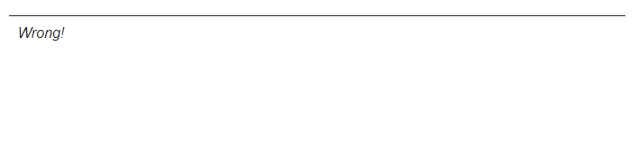
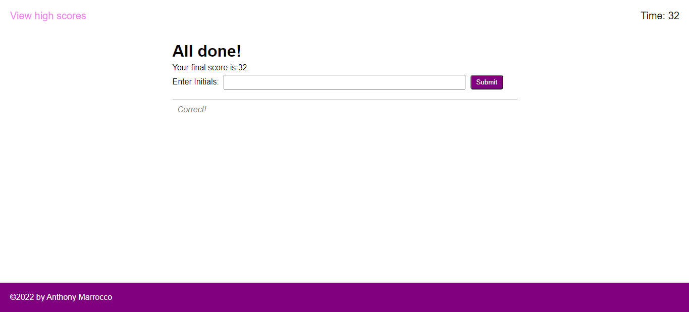

# Code Quiz

## Purpose
A website that creates a timed quiz of the fundamentals of JavaScript. This website will then store high scores to compare with your classmates.

## Built With
* HTML
* CSS
* JavaScript

## Website 
https://ajmarrocco.github.io/ajm-code-quiz/

## Contribution
Made by Anthony Marrocco

## Images with Descriptions

### Home Page

 

### First Question

 

### Second Question

 

### Third Question

 

### Fourth Question

 

### Fifth Question

 

### Shows for correct answer

 

### Shows for wrong answer

 

### Time is out

 

### All done with score

 

### Saves scores in local storage

 

### Displays high scores

 

### Before scores are added

 

